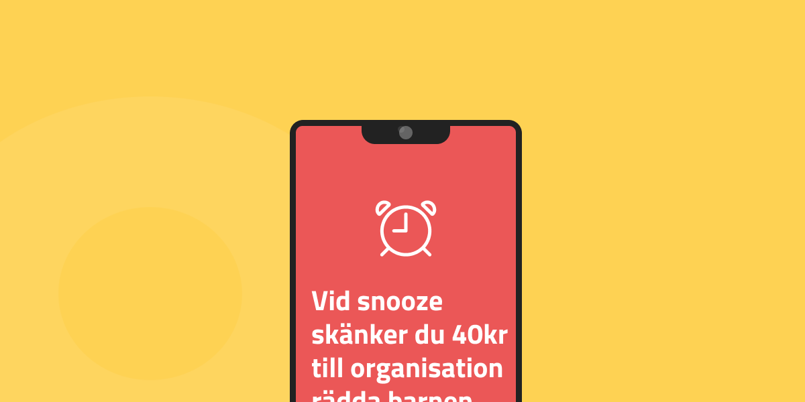

# Wake App

## Problembeskrivning
Under covid-19 har vårt samhälle och dess medborgare utsatts för en stor stress. Dels stressen att bli smittad och svårt sjuk, men också stressen att hantera vardagen mer på distans.
Ett av områdena som påverkats mycket är sömn. Då mycket av vardagens bestyr sker från hemmet har gränserna mellan studier / arbetsliv och hemmaliv grusats ut. 

Detta tillsammans med ökad stress gör att rutiner och sömn påverkas negativt.

**Wake App** är en ny startup som ser möjligheter med att förbättra sömn och framförallt vaknandet genom att utveckla *den ultimata väckarklockan i mobilformat*.

**Hur får man den mest morgontrötte att komma upp på morgnarna?**

## Arbetsform
Metoden ni ska ta er an detta projekt är via UX-processen vi gått igenom under föreläsningarna.
Er kontinuerliga teamkommunikation väljer ni själva i gruppen ( slack, discord ).

## Tekniska krav
Det skall gå att navigera runt i applikationen i Figma.
